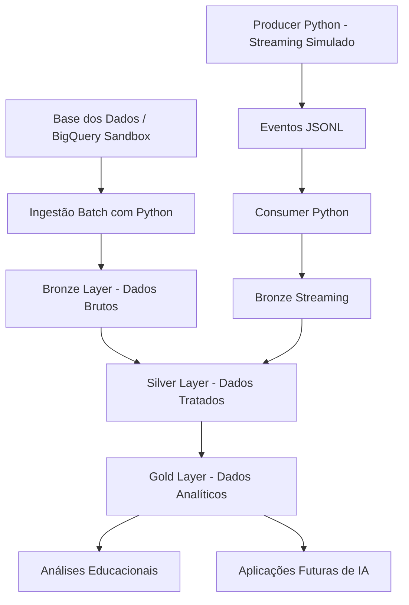

# TechChallenge Fase 2 - Pipeline Híbrido para Análise da Alfabetização no Brasil

Projeto desenvolvido para o **Tech Challenge - Fase 2**, da **FIAP**, turma **1IAST**, com o objetivo de construir uma pipeline híbrida de dados para análise da alfabetização no Brasil.

## Integrante

* Andre Correa Luis Vilas Boas

---

## 1. Contexto do problema

A alfabetização na infância é um dos principais indicadores de desenvolvimento educacional, social e econômico de um país. No Brasil, políticas públicas como o **Compromisso Nacional Criança Alfabetizada** buscam garantir que todas as crianças estejam alfabetizadas até o final do 2º ano do ensino fundamental.

Para apoiar esse tipo de análise, é necessário integrar diferentes fontes de dados educacionais, territoriais e de desempenho. Esses dados permitem identificar desigualdades regionais, acompanhar metas nacionais, estaduais e municipais, além de apoiar a formulação de políticas públicas baseadas em evidências.

Este projeto propõe uma pipeline de dados híbrida, combinando ingestão **Batch** e simulação de ingestão **Streaming**, organizada segundo a arquitetura **Medalhão**, com camadas **Bronze**, **Silver** e **Gold**.

---

## 2. Objetivo do projeto

Construir uma pipeline de dados escalável e organizada para ingestão, tratamento, validação e disponibilização analítica de dados relacionados à alfabetização no Brasil.

A solução tem como objetivos principais:

* realizar ingestão batch de dados públicos educacionais;
* simular ingestão streaming de atualizações de indicadores;
* organizar os dados nas camadas Bronze, Silver e Gold;
* aplicar regras de qualidade de dados;
* gerar bases analíticas confiáveis;
* documentar decisões arquiteturais;
* considerar práticas de monitoramento e FinOps;
* demonstrar como a camada Gold pode apoiar análises educacionais e aplicações futuras de IA.

---

## 3. Abordagem de custo zero

Considerando a restrição acadêmica de custo zero, a solução foi desenhada utilizando recursos gratuitos e sem ativação de billing.

O componente cloud principal será o **GCP BigQuery Sandbox**, utilizado para consulta e exploração dos dados públicos. A execução dos pipelines será feita em **Google Colab**, utilizando Python.

A solução evita o uso de serviços pagos ou que exigem conta de faturamento ativa, como Pub/Sub, Cloud Storage, Cloud Run, Dataflow ou Vertex AI.

Apesar disso, a arquitetura lógica foi desenhada de forma compatível com uma futura migração para serviços gerenciados do GCP.

---

## 4. Arquitetura proposta

A arquitetura do projeto combina:

* **BigQuery Sandbox** como componente cloud para acesso aos dados públicos;
* **Google Colab** como ambiente gratuito de execução;
* **Python** para ingestão, transformação, validação e simulação de streaming;
* **Arquitetura Medalhão** para organização dos dados;
* **GitHub** para versionamento, documentação e evidência de evolução do projeto.

### Diagrama da pipeline



---

## 5. Fluxo de dados

### 5.1 Ingestão Batch

A ingestão batch será responsável por coletar dados históricos relacionados ao indicador de alfabetização e às entidades obrigatórias do desafio.

O fluxo batch seguirá a seguinte sequência:

1. consulta dos dados na Base dos Dados via BigQuery Sandbox;
2. extração dos dados para o ambiente Google Colab;
3. gravação dos dados brutos na camada Bronze;
4. transformação dos dados para a camada Silver;
5. criação de bases analíticas na camada Gold.

### 5.2 Ingestão Streaming Simulada

Como a solução foi desenhada para operar sem custos, a ingestão streaming será simulada por scripts Python.

O fluxo streaming seguirá a seguinte sequência:

1. geração de eventos simulados em formato JSONL;
2. leitura dos eventos por um consumer Python;
3. gravação dos eventos na camada Bronze Streaming;
4. tratamento e validação dos eventos;
5. integração dos eventos processados às camadas Silver e Gold.

Essa simulação representa cenários como atualização de indicadores, novas medições de desempenho ou revisão de metas educacionais.

---

## 6. Arquitetura Medalhão

A solução será organizada em três camadas principais.

### 6.1 Bronze Layer

A camada Bronze armazenará os dados brutos, preservando o conteúdo original da ingestão.

Exemplos:

* dados extraídos da Base dos Dados;
* arquivos brutos da ingestão batch;
* eventos JSONL da simulação streaming;
* histórico de ingestão.

Diretório previsto:

```text
data/bronze/
```

### 6.2 Silver Layer

A camada Silver armazenará os dados tratados, limpos e padronizados.

Transformações previstas:

* padronização de nomes de colunas;
* conversão de tipos de dados;
* tratamento de valores ausentes;
* remoção ou identificação de duplicidades;
* validação de chaves de relacionamento;
* normalização de códigos de município e UF.

Diretório previsto:

```text
data/silver/
```

### 6.3 Gold Layer

A camada Gold armazenará bases analíticas prontas para consumo.

Exemplos de datasets Gold:

* indicador de alfabetização por município;
* comparação entre metas e resultados;
* evolução temporal do indicador;
* ranking de municípios abaixo da meta;
* visão consolidada por UF.

Diretório previsto:

```text
data/gold/
```

---

## 7. Fontes de dados

A fonte principal do projeto será a **Base dos Dados**, com foco no indicador relacionado à alfabetização no Brasil.

As entidades previstas para integração são:

* UF;
* município;
* meta de alfabetização nacional;
* meta de alfabetização por UF;
* meta de alfabetização por município;
* dados educacionais relacionados aos alunos e indicadores de desempenho.

Nesta primeira versão, o projeto prioriza as fontes obrigatórias do desafio. Fontes externas, como IBGE ou Censo Escolar, poderão ser consideradas em uma evolução futura.

---

## 8. Tecnologias utilizadas

| Tecnologia                   | Finalidade                                           |
| ---------------------------- | ---------------------------------------------------- |
| GCP BigQuery Sandbox         | Consulta cloud dos dados públicos                    |
| Google Colab                 | Execução gratuita dos notebooks e scripts            |
| Python                       | Linguagem principal da pipeline                      |
| Pandas                       | Tratamento e transformação dos dados                 |
| PyArrow                      | Manipulação de arquivos Parquet                      |
| Google Cloud BigQuery Client | Integração Python com BigQuery                       |
| CSV                          | Armazenamento inicial e conferência dos dados brutos |
| Parquet                      | Armazenamento otimizado nas camadas tratadas         |
| JSONL                        | Simulação de eventos streaming                       |
| GitHub                       | Versionamento, documentação e evidência de evolução  |

---

## 9. Qualidade de dados

A pipeline incluirá validações para garantir maior confiabilidade dos dados processados.

Regras previstas:

* verificação de valores ausentes;
* detecção de duplicidades;
* validação de chaves de relacionamento;
* consistência entre município e UF;
* validação de tipos de dados;
* validação de percentuais em faixas esperadas;
* geração de relatório de qualidade.

Exemplos de scripts previstos:

```text
src/quality/validate_nulls.py
src/quality/validate_duplicates.py
src/quality/validate_relationships.py
src/quality/generate_quality_report.py
```

---

## 10. Monitoramento

O monitoramento será implementado de forma simples, por meio de logs gerados durante a execução da pipeline.

Serão registrados:

* data e hora de início da execução;
* data e hora de término;
* quantidade de registros processados;
* status da execução;
* falhas encontradas;
* tempo de processamento;
* resultado das validações de qualidade.

Arquivos previstos:

```text
logs/pipeline_execution.log
logs/quality_report.json
```

Em uma arquitetura produtiva, esses logs poderiam ser enviados para ferramentas como Cloud Logging e Cloud Monitoring.

---

## 11. FinOps

A solução foi desenhada considerando boas práticas de FinOps e restrição de custo zero.

Decisões adotadas:

* uso do BigQuery Sandbox sem ativação de billing;
* execução em Google Colab;
* ausência de serviços pagos na primeira versão;
* uso de dados controlados para evitar consumo excessivo;
* separação das camadas Bronze, Silver e Gold para evitar reprocessamentos desnecessários;
* uso de Parquet nas camadas tratadas para otimizar armazenamento e leitura;
* documentação de uma possível migração futura para serviços gerenciados do GCP.

Em uma versão produtiva, a arquitetura poderia evoluir para:

* Cloud Storage como Data Lake;
* Pub/Sub para ingestão streaming real;
* Dataflow ou Cloud Run para processamento;
* BigQuery como camada analítica principal;
* Cloud Monitoring para observabilidade.

---

## 12. Decisões arquiteturais

### 12.1 Batch vs Streaming

O processamento batch será utilizado para dados históricos e cargas periódicas.

A ingestão streaming será simulada para representar atualizações quase em tempo real, como novos indicadores, revisões de metas ou medições de desempenho.

Essa combinação permite demonstrar uma arquitetura híbrida sem gerar custos adicionais.

### 12.2 Data Lake vs Data Warehouse

A estrutura local em pastas Bronze, Silver e Gold representa o conceito de Data Lake organizado.

O BigQuery Sandbox será utilizado como componente cloud para consulta e exploração dos dados públicos.

Em um ambiente produtivo, a camada Gold poderia ser disponibilizada em um Data Warehouse, como o BigQuery, para facilitar análises, dashboards e consumo por aplicações.

### 12.3 Custo vs Performance

Como o projeto possui restrição de custo zero, a arquitetura prioriza simplicidade, reprodutibilidade e controle de consumo.

O uso de Parquet, separação de camadas e execução sob demanda ajuda a reduzir desperdício de processamento e armazenamento.

---

## 13. Aplicação em IA

A camada Gold poderá ser utilizada futuramente como base para aplicações de inteligência artificial e análise avançada.

Possíveis aplicações:

* predição do percentual de alfabetização por município;
* identificação de municípios com maior risco de não atingir a meta;
* análise de desigualdade educacional entre regiões;
* agrupamento de municípios por perfil de desempenho;
* priorização de políticas públicas;
* identificação de padrões anômalos em indicadores educacionais.

O objetivo desta entrega não é treinar um modelo de machine learning completo, mas preparar uma base analítica confiável para esse tipo de uso futuro.

---

## 14. Estrutura do repositório

```text
techchallenge-fase2-pipeline-alfabetizacao/
│
├── README.md
├── requirements.txt
├── .gitignore
│
├── docs/
│
├── sql/
│
├── src/
│   ├── ingestion/
│   ├── processing/
│   ├── quality/
│   ├── monitoring/
│   └── utils/
│
├── data/
│   ├── bronze/
│   │   ├── batch/
│   │   └── streaming/
│   ├── silver/
│   └── gold/
│
├── logs/
│
├── notebooks/
│
└── tests/
```

---

## 15. Como executar o projeto

A execução será feita em Google Colab.

Fluxo previsto:

1. abrir o notebook principal em `notebooks/`;
2. configurar o acesso ao BigQuery Sandbox;
3. executar a ingestão batch;
4. gerar arquivos na camada Bronze;
5. executar transformações para Silver;
6. gerar datasets analíticos na Gold;
7. executar a simulação de streaming;
8. rodar validações de qualidade;
9. consultar os logs e relatórios gerados.

As instruções detalhadas de execução serão complementadas ao longo do desenvolvimento do projeto.

---

## 16. Estratégia de versionamento

O projeto utilizará GitHub para versionamento.

Estratégia prevista:

* `main`: versão final estável;
* `develop`: branch de integração;
* `feature/*`: branches para desenvolvimento de funcionalidades específicas.

Exemplos de branches:

```text
feature/setup-project
feature/batch-ingestion
feature/bronze-silver-gold
feature/streaming-simulation
feature/data-quality
feature/monitoring-finops
feature/readme-documentation
```

Exemplos de commits:

```text
chore: create initial project structure
docs: add initial README documentation
feat: add batch ingestion pipeline
feat: implement bronze to silver transformation
feat: create gold analytical datasets
feat: add streaming simulation
feat: add data quality validation scripts
docs: add finops and monitoring sections
```

---

## 17. Status do projeto

| Etapa                            | Status             |
| -------------------------------- | ------------------ |
| Estrutura inicial do repositório | Concluído          |
| README inicial                   | Em desenvolvimento |
| Ingestão batch                   | Pendente           |
| Camada Bronze                    | Pendente           |
| Camada Silver                    | Pendente           |
| Camada Gold                      | Pendente           |
| Streaming simulado               | Pendente           |
| Qualidade de dados               | Pendente           |
| Monitoramento                    | Pendente           |
| FinOps                           | Pendente           |
| Roteiro do vídeo                 | Pendente           |

---

## 18. Conclusão

Este projeto propõe uma pipeline híbrida para análise da alfabetização no Brasil, utilizando uma abordagem gratuita, reprodutível e alinhada aos conceitos modernos de engenharia de dados.

A solução prioriza organização, qualidade, rastreabilidade, controle de custos e preparação da camada analítica para usos futuros em dashboards, análises estatísticas e aplicações de inteligência artificial.
