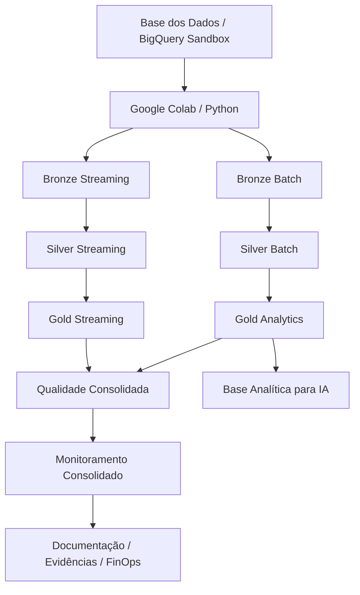
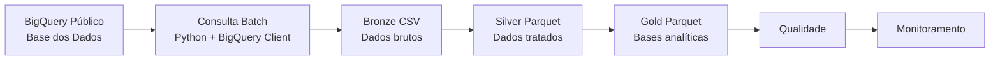
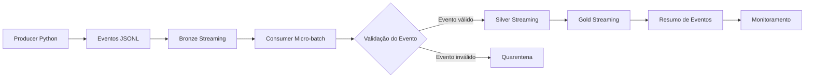

# TechChallenge Fase 2 — Pipeline Híbrido para Análise da Alfabetização no Brasil

## 1. Contexto

Este projeto foi desenvolvido para o **TechChallenge Fase 2 — FIAP**, com o objetivo de construir uma pipeline híbrida de dados para análise da alfabetização no Brasil.

O desafio está relacionado ao acompanhamento do **Indicador Criança Alfabetizada**, dentro do contexto do Compromisso Nacional Criança Alfabetizada. A solução busca integrar dados públicos educacionais, estruturar uma arquitetura em camadas e disponibilizar bases analíticas para apoiar decisões públicas, análise de desempenho educacional e futuras aplicações de Inteligência Artificial.

A proposta utiliza dados públicos da **Base dos Dados**, acessados por meio do **Google Cloud BigQuery Sandbox**, com execução em **Google Colab**, mantendo a restrição acadêmica de **custo zero**.

---

## 2. Objetivo do Projeto

Construir uma pipeline híbrida, com processamento **Batch** e **Streaming simulado**, utilizando ambiente cloud gratuito, arquitetura Medalhão e dados públicos educacionais.

A solução contempla:

- ingestão Batch de dados públicos educacionais;
- simulação de eventos em tempo quase real;
- organização em camadas Bronze, Silver e Gold;
- validação de qualidade de dados;
- geração de bases analíticas;
- monitoramento consolidado;
- estratégia FinOps;
- documentação técnica;
- preparação de base para uso futuro em Inteligência Artificial.

---

## 3. Autor

- **Andre Correa Luis Vilas Boas**
- Instituição: **FIAP**
- Turma: **1IAST**
- Repositório: `https://github.com/acorrea79/techchallenge-fase2-pipeline-alfabetizacao`

---

## 4. Tecnologias Utilizadas

| Categoria | Tecnologia |
|---|---|
| Cloud | Google Cloud BigQuery Sandbox |
| Execução | Google Colab |
| Linguagem | Python |
| Manipulação de dados | Pandas, NumPy |
| Formato Bronze Batch | CSV |
| Formato Bronze Streaming | JSONL |
| Formato Silver/Gold | Parquet |
| Streaming | Simulação Python em micro-batches |
| Qualidade | Validações customizadas em Python |
| Monitoramento | Logs, manifestos e relatórios consolidados |
| Versionamento | Git e GitHub |
| Documentação | Markdown e Mermaid |

---

## 5. Fonte dos Dados

A pipeline utiliza dados públicos da **Base dos Dados**, disponíveis via BigQuery público:

```text
basedosdados.br_inep_avaliacao_alfabetizacao
```

Tabelas utilizadas:

| Tabela | Finalidade |
|---|---|
| `alunos` | Dados de alunos, proficiência, presença e status de alfabetização |
| `dicionario` | Dicionário dos campos |
| `meta_alfabetizacao_brasil` | Metas nacionais de alfabetização |
| `meta_alfabetizacao_uf` | Metas de alfabetização por UF |
| `meta_alfabetizacao_municipio` | Metas de alfabetização por município |
| `municipio` | Indicadores por município |
| `uf` | Indicadores por UF |

Durante a descoberta dos dados, foi identificado que a tabela `alunos` possui maior volume, com aproximadamente 3,8 milhões de linhas. Por isso, ela foi tratada com estratégia específica de FinOps, usando amostra controlada e agregação.

---

## 6. Arquitetura Geral



A arquitetura foi desenhada para demonstrar uma solução híbrida de engenharia de dados com baixo custo, rastreabilidade e potencial de evolução para um ambiente produtivo em cloud.

---

## 7. Arquitetura Medalhão

A solução utiliza a arquitetura Medalhão, separando os dados em três camadas principais.

### 7.1 Bronze

A camada Bronze armazena os dados brutos ou minimamente controlados.

Principais saídas Batch:

```text
data/bronze/batch/meta_alfabetizacao_brasil.csv
data/bronze/batch/meta_alfabetizacao_uf.csv
data/bronze/batch/meta_alfabetizacao_municipio.csv
data/bronze/batch/municipio.csv
data/bronze/batch/uf.csv
data/bronze/batch/dicionario.csv
data/bronze/batch/alunos_sample.csv
data/bronze/batch/alunos_agregado.csv
```

Principais saídas Streaming:

```text
data/bronze/streaming/events/*.jsonl
data/bronze/streaming/quarantine/*.jsonl
```

### 7.2 Silver

A camada Silver realiza tratamento, padronização e validação estrutural.

Transformações aplicadas:

- padronização de nomes de colunas;
- normalização de chaves;
- conversão de tipos;
- remoção de duplicidades;
- validação de campos obrigatórios;
- validação de faixas percentuais;
- inclusão de metadados técnicos;
- gravação em Parquet.

Principais saídas:

```text
data/silver/*.parquet
data/silver/streaming/*.parquet
```

### 7.3 Gold

A camada Gold entrega bases analíticas finais.

Datasets Gold gerados:

| Dataset | Objetivo |
|---|---|
| `gold_indicador_municipio.parquet` | Indicador municipal integrado |
| `gold_comparativo_meta_resultado_municipio.parquet` | Comparativo entre meta e resultado municipal |
| `gold_ranking_municipios_prioritarios.parquet` | Ranking de municípios prioritários |
| `gold_indicador_uf.parquet` | Indicador consolidado por UF |
| `gold_evolucao_alfabetizacao_uf.parquet` | Evolução temporal por UF |
| `gold_base_ia_alfabetizacao.parquet` | Base preparada para futuras aplicações de IA |
| `gold_streaming_indicadores_recentes_*.parquet` | Indicadores recentes oriundos do streaming simulado |
| `gold_streaming_resumo_eventos_*.parquet` | Resumo dos eventos processados |

---

## 8. Fluxo Batch



A ingestão Batch utiliza o BigQuery Sandbox para consultar os dados públicos e gerar arquivos locais reproduzíveis no Colab.

A tabela `alunos`, por possuir maior volume, foi tratada com estratégia FinOps:

- amostra controlada de 100.000 linhas;
- visão agregada por ano, município, rede e série;
- seleção explícita de colunas;
- redução de custo e volume processado.

---

## 9. Fluxo Streaming Simulado



O streaming foi simulado em Python para atender ao requisito de pipeline híbrida sem utilizar serviços pagos, como Pub/Sub ou Dataflow.

Tipos de eventos simulados:

- atualização de indicador;
- nova medição de desempenho;
- atualização de meta ou resultado.

Validações aplicadas nos eventos:

- campos obrigatórios;
- duplicidade de `event_id`;
- tipo de evento permitido;
- formato de município;
- taxa de alfabetização entre 0 e 100;
- envio de eventos inválidos para quarentena.

---

## 10. Qualidade de Dados

A pipeline executa validações consolidadas nas camadas Bronze, Silver, Gold e Streaming.

Validações realizadas:

- existência de arquivos obrigatórios;
- datasets não vazios;
- colunas obrigatórias;
- campos obrigatórios não nulos;
- duplicidades por chave de negócio;
- faixas percentuais entre 0 e 100;
- consistência de UF;
- consistência do ranking Gold;
- validação dos eventos de streaming;
- reclassificação de alertas esperados.

Resultado final da qualidade:

```text
executive_quality_status: approved_with_warnings
failed_checks: 0
```

Os warnings são controlados e documentados, incluindo valores nulos esperados em métricas informativas de origem e eventos inválidos simulados para demonstrar quarentena.

---

## 11. Monitoramento

A solução gera monitoramento consolidado com:

- status por camada;
- quantidade de componentes monitorados;
- alertas críticos;
- warnings;
- métricas de streaming;
- status da qualidade;
- status FinOps;
- logs de execução.

Resultado final do monitoramento:

```text
executive_monitoring_status: approved_with_warnings
failed_components: 0
critical_alerts: 0
```

Os warnings são controlados e explicados na documentação, não representando falha crítica da pipeline.

---

## 12. Estratégia FinOps

A solução foi construída com a restrição de **custo zero**.

Decisões FinOps adotadas:

- uso do BigQuery Sandbox;
- uso do Google Colab;
- não ativação de billing;
- não uso de serviços pagos;
- controle da tabela `alunos`;
- uso de amostra controlada;
- uso de agregação para reduzir granularidade;
- seleção explícita de colunas;
- uso de Parquet em Silver e Gold;
- dry run do BigQuery para estimar bytes processados;
- streaming simulado em vez de Pub/Sub/Dataflow.

Documentos relacionados:

```text
docs/cloud_bigquery_evidence.md
docs/finops_strategy.md
```

---

## 13. Aplicação em Inteligência Artificial

A camada Gold gera a base:

```text
gold_base_ia_alfabetizacao.parquet
```

Essa base pode apoiar aplicações futuras como:

- previsão de risco de baixa alfabetização;
- classificação de municípios prioritários;
- clusterização de municípios por perfil educacional;
- recomendação de políticas públicas;
- análise de evolução temporal;
- identificação de padrões por UF, rede e município.

Exemplos de variáveis úteis para IA:

- ano;
- município;
- UF;
- rede;
- série;
- taxa de alfabetização;
- meta de referência;
- distância até a meta;
- status da meta;
- média de proficiência;
- volume de alunos.

---

## 14. Organização do Código

O notebook principal permanece como fluxo de execução no Colab:

```text
notebooks/pipeline_alfabetizacao.ipynb
```

Além do notebook, o projeto possui scripts organizados em `src/`, demonstrando a modularização da solução.

```text
src/
├── ingestion/
│   └── batch_ingestion.py
├── processing/
│   ├── silver_transform.py
│   └── gold_transform.py
├── streaming/
│   └── simulated_streaming.py
├── quality/
│   └── data_quality.py
├── monitoring/
│   └── pipeline_monitoring.py
└── utils/
    └── file_utils.py
```

A documentação da organização do código está em:

```text
docs/code_organization.md
```

---

## 15. Estrutura do Repositório

```text
techchallenge-fase2-pipeline-alfabetizacao/
├── docs/
│   ├── architecture.md
│   ├── cloud_bigquery_evidence.md
│   ├── code_organization.md
│   ├── diagrams.md
│   ├── finops_strategy.md
│   ├── monitoring_strategy.md
│   ├── versioning_strategy.md
│   └── diagrams/
├── notebooks/
│   └── pipeline_alfabetizacao.ipynb
├── sql/
│   ├── 01_descoberta_tabelas.sql
│   ├── 02_finops_queries.sql
│   └── 03_gold_analytical_queries.sql
├── src/
│   ├── ingestion/
│   ├── processing/
│   ├── streaming/
│   ├── quality/
│   ├── monitoring/
│   └── utils/
├── data/
│   ├── bronze/
│   ├── silver/
│   ├── gold/
│   ├── quality/
│   ├── monitoring/
│   └── evidence/
├── logs/
├── requirements.txt
├── .gitignore
└── README.md
```

A pasta `data/` contém artefatos gerados pela execução e não deve ser versionada integralmente no GitHub.

---

## 16. Como Executar

### 16.1 Abrir o notebook

Abrir o notebook principal no Google Colab:

```text
notebooks/pipeline_alfabetizacao.ipynb
```

### 16.2 Instalar dependências

O notebook instala e utiliza as bibliotecas necessárias:

```text
pandas
numpy
pyarrow
google-cloud-bigquery
db-dtypes
matplotlib
```

### 16.3 Autenticar no Google

Durante a execução, o Colab solicita autenticação Google para acesso ao BigQuery.

### 16.4 Confirmar o projeto GCP

Projeto utilizado:

```text
fiap-techchallenge-fase2
```

### 16.5 Executar as células em ordem

As células devem ser executadas sequencialmente, cobrindo:

```text
descoberta das tabelas
ingestão Batch
Bronze
Silver
Gold
Streaming simulado
Qualidade
BigQuery / FinOps
Monitoramento
```

### 16.6 Validar os artefatos gerados

As principais pastas geradas são:

```text
data/bronze/
data/silver/
data/gold/
data/quality/
data/monitoring/
data/evidence/
logs/
```

---

## 17. Documentação Complementar

| Documento | Descrição |
|---|---|
| `docs/architecture.md` | Arquitetura da solução |
| `docs/diagrams.md` | Diagramas Mermaid finais |
| `docs/cloud_bigquery_evidence.md` | Evidências de uso do BigQuery Sandbox |
| `docs/finops_strategy.md` | Estratégia FinOps |
| `docs/monitoring_strategy.md` | Estratégia de monitoramento |
| `docs/code_organization.md` | Organização dos scripts Python |
| `docs/versioning_strategy.md` | Estratégia de versionamento |

---

## 18. Consultas SQL

A pasta `sql/` contém consultas auxiliares usadas na documentação e análise:

```text
sql/01_descoberta_tabelas.sql
sql/02_finops_queries.sql
sql/03_gold_analytical_queries.sql
```

Esses arquivos documentam:

- descoberta das tabelas públicas;
- análise de volume;
- estimativas FinOps;
- consultas analíticas sobre a camada Gold.

---

## 19. Decisões Arquiteturais

| Decisão | Justificativa |
|---|---|
| BigQuery Sandbox | Uso real de cloud sem billing |
| Google Colab | Execução gratuita e reproduzível |
| CSV na Bronze | Simplicidade e rastreabilidade dos dados brutos |
| JSONL no Streaming | Formato simples e comum para eventos |
| Parquet na Silver/Gold | Eficiência analítica e menor volume |
| Streaming simulado | Demonstração híbrida sem custo |
| Micro-batches | Controle operacional e simplicidade |
| Manifestos JSON | Rastreabilidade das execuções |
| Docs Markdown | Facilidade de avaliação no GitHub |
| Scripts em `src/` | Organização modular do código |

---

## 20. Trade-offs

### 20.1 Vantagens

- custo zero;
- reprodutibilidade;
- arquitetura clara;
- uso real de BigQuery;
- camadas bem separadas;
- qualidade e monitoramento;
- documentação completa;
- base preparada para IA;
- organização modular do código.

### 20.2 Limitações

- não usa Pub/Sub real;
- não usa Dataflow real;
- não materializa Gold em BigQuery;
- não utiliza Cloud Storage;
- arquivos de dados são reproduzidos no Colab;
- ambiente local do Colab é temporário.

Essas limitações são decisões conscientes para atender à restrição acadêmica de custo zero.

---

## 21. Evolução Futura

Em um cenário produtivo, a arquitetura poderia evoluir para:

- Cloud Storage para camadas Bronze/Silver/Gold;
- BigQuery Tables para a camada Gold;
- Pub/Sub para streaming real;
- Dataflow para processamento em tempo real;
- Cloud Composer para orquestração;
- Cloud Monitoring para alertas;
- Looker Studio para dashboards;
- BigQuery ML ou Vertex AI para modelos preditivos;
- GitHub Actions para CI/CD;
- testes automatizados de qualidade.

---

## 22. Status Final da Entrega

| Etapa | Status |
|---|---|
| Arquitetura | Concluída |
| Repositório | Concluído |
| Notebook principal | Concluído |
| Descoberta das tabelas | Concluída |
| Ingestão Batch | Concluída |
| Bronze | Concluída |
| Silver | Concluída |
| Gold | Concluída |
| Streaming simulado | Concluído |
| Qualidade consolidada | Aprovada com warnings controlados |
| Evidências Cloud / BigQuery | Concluídas |
| Estratégia FinOps | Concluída |
| Monitoramento | Aprovado com warnings controlados |
| Scripts Python | Concluídos |
| Documentação | Concluída |

---

## 23. Conclusão

O projeto entrega uma pipeline híbrida de dados para análise da alfabetização no Brasil, utilizando BigQuery Sandbox, Google Colab, arquitetura Medalhão, processamento Batch, Streaming simulado, validação de qualidade, monitoramento consolidado, estratégia FinOps e base analítica preparada para aplicações futuras de IA.

A solução atende ao desafio mantendo custo zero, rastreabilidade, organização técnica e potencial de evolução para ambiente produtivo em cloud.