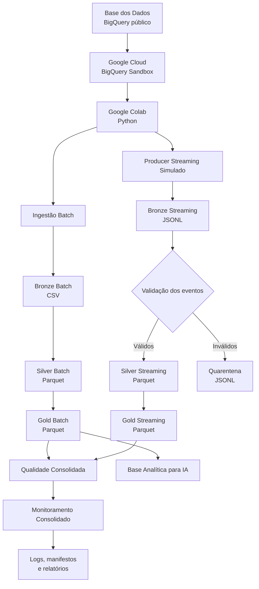
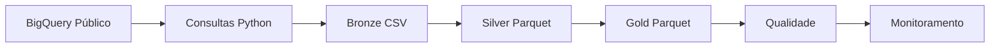
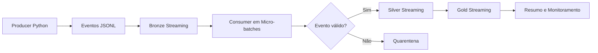

# TechChallenge Fase 2 — Pipeline Híbrido para Análise da Alfabetização no Brasil

[](https://colab.research.google.com/github/acorrea79/techchallenge-fase2-pipeline-alfabetizacao/blob/main/notebooks/pipeline_alfabetizacao.ipynb)

> Projeto acadêmico desenvolvido individualmente para a FIAP — turma 1IAST.

---

## Sumário

1. [Visão geral](#1-visão-geral)
2. [Contexto do problema](#2-contexto-do-problema)
3. [Objetivos](#3-objetivos)
4. [Escopo implementado](#4-escopo-implementado)
5. [Arquitetura da solução](#5-arquitetura-da-solução)
6. [Fontes de dados](#6-fontes-de-dados)
7. [Arquitetura Medalhão](#7-arquitetura-medalhão)
8. [Pipeline Batch](#8-pipeline-batch)
9. [Streaming simulado](#9-streaming-simulado)
10. [Qualidade e governança](#10-qualidade-e-governança)
11. [Monitoramento](#11-monitoramento)
12. [FinOps](#12-finops)
13. [Camada Gold e aplicação em IA](#13-camada-gold-e-aplicação-em-ia)
14. [Tecnologias e justificativas](#14-tecnologias-e-justificativas)
15. [Decisões arquiteturais e trade-offs](#15-decisões-arquiteturais-e-trade-offs)
16. [Organização do código](#16-organização-do-código)
17. [Estrutura do repositório](#17-estrutura-do-repositório)
18. [Como executar](#18-como-executar)
19. [Evidências e documentação](#19-evidências-e-documentação)
20. [Versionamento](#20-versionamento)
21. [Limitações conhecidas](#21-limitações-conhecidas)
22. [Evolução para ambiente produtivo](#22-evolução-para-ambiente-produtivo)
23. [Vídeo executivo](#23-vídeo-executivo)
24. [Status da entrega](#24-status-da-entrega)
25. [Conclusão](#25-conclusão)

---

## 1. Visão geral

Este projeto implementa uma pipeline híbrida de dados para análise da alfabetização no Brasil, utilizando dados públicos do **Indicador Criança Alfabetizada**.

A solução foi construída com:

- ingestão Batch;
- simulação de Streaming em micro-batches;
- arquitetura Medalhão com camadas Bronze, Silver e Gold;
- tratamento e integração de dados;
- validações de qualidade;
- monitoramento operacional;
- práticas de FinOps;
- produtos analíticos;
- preparação de uma base para aplicações futuras de Inteligência Artificial.

Os dados são consultados no **Google Cloud BigQuery Sandbox**, e o processamento é executado no **Google Colab**, mantendo a restrição acadêmica de **custo real igual a zero**.

O projeto foi desenvolvido individualmente por:

**Andre Correa Luis Vilas Boas**

- Instituição: FIAP
- Turma: 1IAST
- Repositório: `acorrea79/techchallenge-fase2-pipeline-alfabetizacao`

---

## 2. Contexto do problema

A alfabetização na infância é um dos principais indicadores de desenvolvimento educacional e social.

No contexto do **Compromisso Nacional Criança Alfabetizada**, o acompanhamento dos resultados depende da integração de diferentes informações, como:

- metas nacionais;
- metas por Unidade da Federação;
- metas municipais;
- indicadores territoriais;
- dados de alunos;
- proficiência;
- presença;
- situação de alfabetização;
- evolução histórica dos resultados.

A análise isolada de uma única tabela não é suficiente para compreender as desigualdades educacionais. Por isso, o projeto integra fontes heterogêneas e transforma os dados públicos em produtos analíticos preparados para apoiar:

- identificação de desigualdades;
- comparação entre metas e resultados;
- priorização de municípios;
- acompanhamento da evolução temporal;
- estudos estatísticos;
- futuras aplicações de Machine Learning;
- políticas públicas orientadas por evidências.

---

## 3. Objetivos

### 3.1 Objetivo geral

Construir uma pipeline de dados híbrida, em ambiente cloud gratuito, capaz de ingerir, tratar, integrar, validar e disponibilizar dados relacionados à alfabetização no Brasil.

### 3.2 Objetivos específicos

- consultar dados públicos educacionais no BigQuery;
- integrar as entidades obrigatórias do desafio;
- implementar ingestão Batch;
- simular eventos em tempo quase real;
- organizar os dados em Bronze, Silver e Gold;
- padronizar tipos, nomes e chaves;
- validar duplicidades, nulos, faixas e relacionamentos;
- gerar bases analíticas confiáveis;
- registrar logs, manifestos e métricas;
- monitorar falhas e warnings;
- controlar consumo e custos;
- preparar uma base Gold para aplicações futuras de IA.

---

## 4. Escopo implementado

| Componente | Implementação |
|---|---|
| Cloud | Google Cloud BigQuery Sandbox |
| Ambiente de execução | Google Colab |
| Linguagem | Python |
| Batch | Consultas às tabelas públicas e geração das camadas |
| Streaming | Simulação de eventos em Python com micro-batches |
| Bronze Batch | Arquivos CSV |
| Bronze Streaming | Eventos JSONL |
| Silver | Arquivos Parquet tratados |
| Gold | Arquivos Parquet analíticos |
| Qualidade | Regras customizadas em Python |
| Governança | Chaves, schemas, manifestos, metadados e quarentena |
| Monitoramento | Logs, status, métricas e resumos executivos |
| FinOps | BigQuery Sandbox, dry run, agregação e Parquet |
| IA | Base Gold preparada para uso futuro |
| Versionamento | Git e GitHub |
| Documentação | Markdown, SQL e diagramas Mermaid |

A solução entregue é uma **prova de conceito acadêmica funcional**. O BigQuery é utilizado como fonte e mecanismo de consulta, enquanto as camadas Bronze, Silver e Gold são materializadas no armazenamento temporário do Colab.

---

## 5. Arquitetura da solução



### Fluxo operacional

1. autenticação da conta Google no Colab;
2. criação do cliente BigQuery;
3. descoberta das tabelas e schemas;
4. análise do volume das fontes;
5. ingestão Batch;
6. materialização da Bronze;
7. tratamento e padronização na Silver;
8. integração e criação dos produtos Gold;
9. geração de eventos simulados;
10. processamento dos eventos em micro-batches;
11. separação de eventos inválidos em quarentena;
12. validações consolidadas de qualidade;
13. geração das evidências FinOps;
14. consolidação do monitoramento;
15. geração de logs, manifestos e relatórios.

---

## 6. Fontes de dados

Foi utilizado o dataset público:

```text
basedosdados.br_inep_avaliacao_alfabetizacao
```

### Entidades utilizadas

| Tabela | Finalidade |
|---|---|
| `alunos` | Proficiência, presença, rede, série e situação de alfabetização |
| `dicionario` | Descrição dos campos do dataset |
| `meta_alfabetizacao_brasil` | Metas nacionais |
| `meta_alfabetizacao_uf` | Metas por Unidade da Federação |
| `meta_alfabetizacao_municipio` | Metas por município |
| `municipio` | Indicadores municipais |
| `uf` | Indicadores estaduais |

### Volume identificado

Na execução registrada no notebook, a tabela `alunos` apresentou:

- **3.867.999 registros**;
- aproximadamente **256,10 MB**.

Por ser a tabela de maior volume, foram utilizadas duas estratégias:

1. criação de uma visão agregada por ano, município, rede e série;
2. geração de um recorte técnico de até 100.000 linhas para validação de schema e transformações.

> O recorte de 100.000 linhas é não probabilístico e foi obtido com `LIMIT`. Portanto, ele não é apresentado como amostra estatisticamente representativa da população. Os resultados consolidados utilizam prioritariamente as visões agregadas e os indicadores oficiais.

---

## 7. Arquitetura Medalhão

### 7.1 Bronze

A camada Bronze preserva os dados extraídos com transformações mínimas.

#### Bronze Batch

Principais arquivos gerados:

```text
data/bronze/batch/meta_alfabetizacao_brasil.csv
data/bronze/batch/meta_alfabetizacao_uf.csv
data/bronze/batch/meta_alfabetizacao_municipio.csv
data/bronze/batch/municipio.csv
data/bronze/batch/uf.csv
data/bronze/batch/dicionario.csv
data/bronze/batch/alunos_sample.csv
data/bronze/batch/alunos_agregado.csv
```

#### Bronze Streaming

```text
data/bronze/streaming/events/*.jsonl
data/bronze/streaming/quarantine/*.jsonl
```

A Bronze mantém:

- rastreabilidade da origem;
- histórico da execução;
- dados antes do tratamento analítico;
- eventos válidos e inválidos;
- manifestos e metadados técnicos.

---

### 7.2 Silver

A camada Silver realiza limpeza, padronização e validação estrutural.

Transformações aplicadas:

- padronização dos nomes das colunas;
- conversão de tipos;
- normalização de chaves;
- tratamento de valores ausentes;
- remoção de duplicidades;
- validação de campos obrigatórios;
- validação de percentuais;
- inclusão de metadados técnicos;
- gravação em Parquet.

Principais saídas:

```text
data/silver/silver_alunos_agregado.parquet
data/silver/silver_alunos_sample.parquet
data/silver/silver_dicionario.parquet
data/silver/silver_indicador_uf.parquet
data/silver/silver_meta_alfabetizacao_brasil.parquet
data/silver/silver_meta_alfabetizacao_uf.parquet
data/silver/silver_meta_alfabetizacao_municipio.parquet
data/silver/streaming/*.parquet
```

---

### 7.3 Gold

A camada Gold disponibiliza produtos analíticos prontos para consumo.

| Produto | Finalidade |
|---|---|
| `gold_indicador_municipio.parquet` | Indicadores consolidados por município |
| `gold_indicador_uf.parquet` | Indicadores consolidados por UF |
| `gold_evolucao_alfabetizacao_uf.parquet` | Evolução temporal por UF |
| `gold_comparativo_meta_resultado_municipio.parquet` | Comparação entre metas e resultados |
| `gold_ranking_municipios_prioritarios.parquet` | Priorização de municípios |
| `gold_base_ia_alfabetizacao.parquet` | Base preparada para aplicações futuras de IA |
| `gold_streaming_indicadores_recentes_*.parquet` | Indicadores recentes do Streaming |
| `gold_streaming_resumo_eventos_*.parquet` | Resumo dos eventos processados |

---

## 8. Pipeline Batch

A ingestão Batch consulta periodicamente as fontes históricas e produz as camadas analíticas.



### Características

- consulta real ao BigQuery;
- seleção explícita de colunas;
- redução de granularidade da tabela de alunos;
- preservação dos dados brutos;
- transformação reprodutível;
- geração de manifestos;
- registros de execução;
- tratamento de falhas.

A camada Batch abrange:

- metas nacionais;
- metas estaduais;
- metas municipais;
- indicadores por UF;
- indicadores por município;
- dados agregados de alunos;
- dicionário das fontes.

---

## 9. Streaming simulado

O desafio solicita uma arquitetura híbrida com simulação de eventos em tempo quase real. Para atender ao requisito sem gerar custos, foi desenvolvido um fluxo de Streaming em Python.



### Eventos simulados

- atualização de indicador;
- nova medição de desempenho;
- atualização de meta;
- atualização de resultado.

### Regras aplicadas

- campos obrigatórios;
- tipos de evento permitidos;
- formato do código municipal;
- percentuais entre 0 e 100;
- unicidade de `event_id`;
- deduplicação;
- processamento em micro-batches;
- segregação de eventos inválidos;
- registro das métricas de consumo.

A simulação demonstra a arquitetura híbrida sem utilização de serviços pagos como Pub/Sub ou Dataflow.

---

## 10. Qualidade e governança

A pipeline executa verificações nas camadas Bronze, Silver, Gold e Streaming.

### Regras de qualidade

- existência dos arquivos esperados;
- datasets não vazios;
- presença das colunas obrigatórias;
- valores ausentes em campos críticos;
- duplicidades por chave de negócio;
- validade das faixas percentuais;
- consistência dos códigos de UF;
- normalização de identificadores municipais;
- consistência entre metas e resultados;
- integridade dos produtos Gold;
- coerência do ranking;
- validação dos eventos;
- quarentena de registros inválidos;
- consistência dos manifestos.

### Governança aplicada

- separação por camadas;
- controle de schemas;
- identificação das fontes;
- registro de timestamps;
- manifestos de execução;
- logs por componente;
- quarentena;
- rastreabilidade dos produtos gerados;
- distinção entre warning e falha crítica.

### Última execução registrada

```text
executive_quality_status: approved_with_warnings
approved_checks: 126
warning_checks: 6
failed_checks: 0
total_checks: 132
```

Os warnings refletem situações conhecidas, como valores ausentes existentes na fonte, métricas informativas e eventos inválidos criados propositalmente para demonstrar o funcionamento da quarentena.

O status `approved_with_warnings` indica que não permaneceram falhas críticas bloqueantes segundo as regras implementadas. Ele não significa ausência absoluta de limitações nos dados de origem.

---

## 11. Monitoramento

O monitoramento consolida informações das etapas de:

- descoberta das fontes;
- ingestão Batch;
- Bronze;
- Silver;
- Gold;
- Streaming;
- qualidade;
- FinOps;
- documentação e evidências.

### Informações monitoradas

- status por componente;
- falhas de ingestão;
- arquivos ausentes;
- quantidade de registros;
- duração das etapas;
- eventos processados;
- eventos inválidos;
- volume produzido;
- warnings;
- alertas críticos;
- status consolidado.

### Última execução registrada

```text
executive_monitoring_status: approved_with_warnings
total_components_monitored: 17
warning_components: 7
failed_components: 0
critical_alerts: 0
```

Os warnings foram documentados e não impediram a conclusão da pipeline.

---

## 12. FinOps

O projeto foi construído com a restrição de custo real igual a zero.

### Práticas implementadas

- BigQuery Sandbox;
- Google Colab;
- billing não ativado;
- consultas com seleção explícita de colunas;
- redução da granularidade;
- visão agregada da tabela de maior volume;
- recorte técnico limitado;
- formato Parquet nas camadas Silver e Gold;
- uso de `dry_run` para estimativa de bytes;
- Streaming simulado;
- não utilização de Pub/Sub, Dataflow, Composer ou Cloud Storage.

### Evidência de consumo

Na execução registrada:

- a maior tabela apresentou aproximadamente **256,10 MB**;
- o processamento permaneceu dentro da capacidade gratuita utilizada pelo projeto;
- o custo real foi de **R$ 0,00**.

### Trade-off de custo

A redução de custo foi priorizada em relação à persistência produtiva e à execução distribuída. Por isso:

- os arquivos são materializados no armazenamento temporário do Colab;
- a Gold não é persistida em tabelas BigQuery;
- não existe um data lake permanente no Cloud Storage;
- o Streaming é demonstrado por simulação.

---

## 13. Camada Gold e aplicação em IA

O principal produto para uso futuro em IA é:

```text
gold_base_ia_alfabetizacao.parquet
```

### Possíveis aplicações

- previsão de risco de baixa alfabetização;
- classificação de municípios prioritários;
- clusterização por perfil educacional;
- análise de desigualdade;
- detecção de padrões temporais;
- comparação entre metas e resultados;
- apoio à formulação de políticas públicas.

### Possíveis variáveis

- ano;
- município;
- UF;
- rede;
- série;
- taxa de alfabetização;
- proficiência;
- meta de referência;
- distância até a meta;
- status de atingimento;
- quantidade de alunos.

O projeto não treina um modelo de Machine Learning nesta fase. A entrega prepara e valida a base que poderá alimentar modelos futuros.

---

## 14. Tecnologias e justificativas

| Tecnologia | Uso | Justificativa |
|---|---|---|
| BigQuery Sandbox | Consulta das fontes públicas | Uso real de cloud sem billing |
| Google Colab | Execução da pipeline | Ambiente gratuito e reproduzível |
| Python | Desenvolvimento | Integração com dados, cloud e automação |
| Pandas | Transformações | Facilidade de manipulação tabular |
| NumPy | Operações auxiliares | Suporte a cálculos e tipos |
| PyArrow | Parquet | Eficiência de armazenamento e leitura |
| CSV | Bronze Batch | Simplicidade e rastreabilidade |
| JSONL | Bronze Streaming | Formato adequado para eventos |
| Parquet | Silver e Gold | Menor volume e melhor leitura analítica |
| Mermaid | Diagramas | Documentação versionável no GitHub |
| Git/GitHub | Versionamento | Histórico da evolução e revisão final |

---

## 15. Decisões arquiteturais e trade-offs

### 15.1 Batch versus Streaming

| Batch | Streaming simulado |
|---|---|
| Adequado para dados históricos | Adequado para eventos recentes |
| Processamento periódico | Processamento em micro-batches |
| Menor complexidade operacional | Demonstra atualização quase em tempo real |
| Usado nas tabelas públicas | Usado em eventos produzidos pelo projeto |

A solução combina os dois modelos porque o desafio exige uma pipeline híbrida.

### 15.2 Data lake versus data warehouse

A solução utiliza características de um data lake local:

- arquivos organizados por camada;
- preservação da Bronze;
- formatos abertos;
- Silver e Gold em Parquet.

O BigQuery atua como fonte e mecanismo de consulta, mas a Gold não é materializada como data warehouse persistente.

### 15.3 Custo versus performance

A arquitetura prioriza:

- custo zero;
- simplicidade;
- rastreabilidade;
- reprodutibilidade acadêmica.

Em contrapartida, não implementa:

- processamento distribuído gerenciado;
- armazenamento permanente em cloud;
- Streaming nativo;
- orquestração produtiva.

### 15.4 Notebook versus módulos Python

O notebook foi utilizado como ponto central de execução e demonstração no Google Colab.

A mesma lógica da pipeline está organizada em `src/`, separada por responsabilidade, para facilitar:

- leitura;
- manutenção;
- reutilização;
- evolução da solução;
- transição futura para uma execução totalmente modular.

---

## 16. Organização do código

### Notebook principal

```text
notebooks/pipeline_alfabetizacao.ipynb
```

O notebook centraliza:

- configuração;
- autenticação;
- descoberta das fontes;
- ingestão;
- transformações;
- Streaming;
- qualidade;
- FinOps;
- monitoramento;
- evidências da execução.

### Módulos em `src/`

```text
src/
├── ingestion/
│   └── batch_ingestion.py
├── processing/
│   ├── silver_transform.py
│   └── gold_transform.py
├── streaming/
│   └── simulated_streaming.py
├── quality/
│   └── data_quality.py
├── monitoring/
│   └── pipeline_monitoring.py
└── utils/
    └── file_utils.py
```

A pasta `src/` representa a organização modular da lógica utilizada na solução, enquanto o notebook facilita a execução sequencial, a demonstração e a avaliação acadêmica no Colab.

---

## 17. Estrutura do repositório

```text
techchallenge-fase2-pipeline-alfabetizacao/
├── docs/
│   ├── architecture.md
│   ├── cloud_bigquery_evidence.md
│   ├── code_organization.md
│   ├── diagrams.md
│   ├── finops_strategy.md
│   ├── monitoring_strategy.md
│   ├── versioning_strategy.md
│   └── diagrams/
├── notebooks/
│   └── pipeline_alfabetizacao.ipynb
├── sql/
│   ├── 01_descoberta_tabelas.sql
│   ├── 02_finops_queries.sql
│   └── 03_gold_analytical_queries.sql
├── src/
│   ├── ingestion/
│   ├── processing/
│   ├── streaming/
│   ├── quality/
│   ├── monitoring/
│   └── utils/
├── .gitignore
├── requirements.txt
└── README.md
```

As pastas abaixo são criadas durante a execução:

```text
data/
├── bronze/
├── silver/
├── gold/
├── quality/
├── monitoring/
└── evidence/

logs/
```

Os artefatos de dados e logs não são versionados integralmente porque podem ser reproduzidos pelo notebook e podem aumentar desnecessariamente o tamanho do repositório.

---

## 18. Como executar

### 18.1 Opção recomendada: Google Colab

Abra o notebook pelo botão no início deste README ou pelo caminho:

```text
notebooks/pipeline_alfabetizacao.ipynb
```

### 18.2 Clonar o repositório no Colab

```bash
git clone https://github.com/acorrea79/techchallenge-fase2-pipeline-alfabetizacao.git
cd techchallenge-fase2-pipeline-alfabetizacao
```

### 18.3 Instalar as dependências

```bash
pip install -r requirements.txt
```

Dependências principais:

```text
pandas
numpy
pyarrow
google-cloud-bigquery
db-dtypes
matplotlib
```

### 18.4 Autenticar no Google

Durante a execução, o Colab solicita autorização da conta Google para acesso ao BigQuery.

### 18.5 Projeto GCP utilizado

```text
fiap-techchallenge-fase2
```

### 18.6 Executar as células em ordem

A sequência cobre:

1. instalação das bibliotecas;
2. configurações;
3. autenticação;
4. cliente BigQuery;
5. descoberta das tabelas;
6. schemas e volumes;
7. ingestão Batch;
8. Bronze;
9. Silver;
10. Gold;
11. Streaming simulado;
12. qualidade;
13. FinOps;
14. monitoramento;
15. geração dos relatórios.

### 18.7 Validar os artefatos

Após a execução, verificar:

```text
data/bronze/
data/silver/
data/gold/
data/quality/
data/monitoring/
data/evidence/
logs/
```

---

## 19. Evidências e documentação

| Documento | Conteúdo |
|---|---|
| `docs/architecture.md` | Arquitetura da solução |
| `docs/diagrams.md` | Diagramas Mermaid |
| `docs/cloud_bigquery_evidence.md` | Evidências de uso do BigQuery |
| `docs/finops_strategy.md` | Estratégia FinOps |
| `docs/monitoring_strategy.md` | Estratégia de monitoramento |
| `docs/code_organization.md` | Organização do código |
| `docs/versioning_strategy.md` | Estratégia de versionamento |
| `sql/01_descoberta_tabelas.sql` | Descoberta das fontes |
| `sql/02_finops_queries.sql` | Consultas e estimativas FinOps |
| `sql/03_gold_analytical_queries.sql` | Consultas analíticas de referência |

O notebook também preserva outputs selecionados como evidência da execução, sem expor credenciais ou informações pessoais.

---

## 20. Versionamento

O projeto foi desenvolvido individualmente e versionado com Git e GitHub.

O histórico de commits registra a evolução de:

- estrutura inicial;
- ingestão Batch;
- Bronze;
- Silver;
- Gold;
- Streaming;
- qualidade;
- monitoramento;
- FinOps;
- documentação;
- correções finais.

Como não havia outros integrantes, grande parte do desenvolvimento ocorreu na branch principal.

A revisão final foi consolidada em uma branch específica:

```text
fix/final-hardening
```

Essa branch registra correções reais de:

- documentação;
- consistência dos nomes;
- descrição do recorte técnico;
- limpeza do notebook;
- segurança dos arquivos;
- revisão do README;
- aderência ao projeto efetivamente implementado.

A integração final à `main` deve ocorrer por Pull Request, funcionando como evidência de controle de mudanças e autoauditoria. Isso não representa revisão por pares, pois o projeto foi individual.

---

## 21. Limitações conhecidas

A entrega possui as seguintes limitações:

- Streaming simulado em Python;
- ausência de Pub/Sub ou Kafka;
- ausência de Dataflow;
- processamento centralizado no Colab;
- armazenamento temporário;
- Bronze, Silver e Gold não persistidas no Cloud Storage;
- Gold não materializada em tabelas BigQuery;
- recorte de alunos sem representatividade estatística;
- autenticação manual no Colab;
- ausência de CI/CD;
- ausência de testes automatizados formais;
- ausência de dashboard publicado;
- ausência de treinamento de modelo de Machine Learning.

Essas limitações não são apresentadas como funcionalidades implementadas. Elas definem as fronteiras reais da prova de conceito.

## 22. Status da entrega

| Item | Status |
|---|---|
| Contexto e objetivo | Concluído |
| Fontes obrigatórias | Integradas |
| Uso de cloud | Implementado |
| Ingestão Batch | Implementada |
| Bronze | Implementada |
| Silver | Implementada |
| Gold | Implementada |
| Streaming simulado | Implementado |
| Qualidade | Aprovada com warnings controlados |
| Monitoramento | Aprovado com warnings controlados |
| FinOps | Implementado e documentado |
| Base para IA | Gerada |
| Código modular em `src/` | Organizado |
| Notebook principal | Concluído |
| Documentação | Concluída |
| Versionamento por commits | Implementado |
| Branch de revisão final | Criada |
| Pull Request final | Realizada ao concluir a revisão |

---

## 23. Conclusão

O projeto entrega uma pipeline híbrida funcional para análise da alfabetização no Brasil.

A solução utiliza:

- dados públicos;
- BigQuery Sandbox;
- Google Colab;
- Python;
- arquitetura Medalhão;
- ingestão Batch;
- Streaming simulado;
- qualidade de dados;
- governança;
- monitoramento;
- FinOps;
- produtos Gold;
- preparação para Inteligência Artificial.

A implementação atende ao objetivo acadêmico de demonstrar uma arquitetura moderna de engenharia de dados, mantendo custo zero, rastreabilidade e clareza sobre o que foi efetivamente construído.

A documentação também diferencia de forma explícita:

- os componentes implementados;
- as decisões de custo;
- as limitações da prova de conceito;
- as possibilidades de evolução para um ambiente produtivo.
