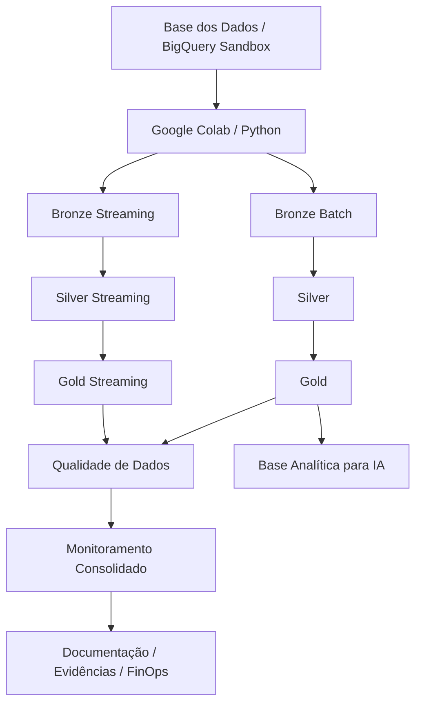
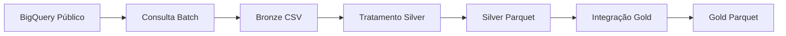
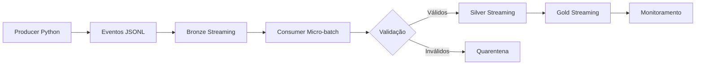

# TechChallenge Fase 2 — Pipeline Híbrido para Análise da Alfabetização no Brasil

## 1. Contexto

Este projeto foi desenvolvido para o **TechChallenge Fase 2 — FIAP**, com o objetivo de construir uma pipeline híbrida de dados para análise da alfabetização no Brasil.

O desafio está relacionado ao acompanhamento do **Indicador Criança Alfabetizada**, dentro do contexto do Compromisso Nacional Criança Alfabetizada. A solução busca integrar dados públicos educacionais, estruturar uma arquitetura em camadas e disponibilizar bases analíticas para apoiar decisões públicas, análise de desempenho educacional e futuras aplicações de Inteligência Artificial.

## 2. Objetivo do Projeto

Construir uma pipeline híbrida, com processamento **Batch** e **Streaming simulado**, utilizando ambiente cloud gratuito, arquitetura Medalhão e dados públicos da Base dos Dados.

A solução contempla:

- ingestão Batch de dados públicos educacionais;
- simulação de eventos em tempo quase real;
- organização em camadas Bronze, Silver e Gold;
- validação de qualidade de dados;
- geração de bases analíticas;
- monitoramento consolidado;
- estratégia FinOps;
- preparação de base para uso futuro em IA.

## 3. Autor

- **Andre Correa Luis Vilas Boas**
- Instituição: **FIAP**
- Turma: **1IAST**
- Repositório: `acorrea79/techchallenge-fase2-pipeline-alfabetizacao`

## 4. Tecnologias Utilizadas

| Categoria | Tecnologia |
|---|---|
| Cloud | Google Cloud BigQuery Sandbox |
| Execução | Google Colab |
| Linguagem | Python |
| Manipulação de dados | Pandas, NumPy |
| Formato Bronze | CSV e JSONL |
| Formato Silver/Gold | Parquet |
| Streaming | Simulação Python em micro-batches |
| Qualidade | Validações customizadas em Python |
| Monitoramento | Logs, manifestos e relatórios consolidados |
| Versionamento | Git e GitHub |
| Documentação | Markdown e Mermaid |

## 5. Fonte dos Dados

A pipeline utiliza dados públicos da **Base dos Dados**, disponíveis via BigQuery público:

```text
basedosdados.br_inep_avaliacao_alfabetizacao
```

Tabelas utilizadas:

| Tabela | Finalidade |
|---|---|
| `alunos` | Dados de alunos e proficiência |
| `dicionario` | Dicionário dos campos |
| `meta_alfabetizacao_brasil` | Metas nacionais |
| `meta_alfabetizacao_uf` | Metas por UF |
| `meta_alfabetizacao_municipio` | Metas por município |
| `municipio` | Indicadores por município |
| `uf` | Indicadores por UF |

## 6. Arquitetura Geral



## 7. Arquitetura Medalhão

### 7.1 Bronze

A camada Bronze armazena os dados brutos ou minimamente controlados.

Arquivos gerados:

```text
data/bronze/batch/*.csv
data/bronze/streaming/events/*.jsonl
data/bronze/streaming/quarantine/*.jsonl
```

Principais saídas Batch:

- `meta_alfabetizacao_brasil.csv`
- `meta_alfabetizacao_uf.csv`
- `meta_alfabetizacao_municipio.csv`
- `municipio.csv`
- `uf.csv`
- `dicionario.csv`
- `alunos_sample.csv`
- `alunos_agregado.csv`

### 7.2 Silver

A camada Silver trata, padroniza e valida os dados.

Transformações aplicadas:

- padronização de nomes de colunas;
- normalização de chaves;
- conversão de tipos;
- remoção de duplicidades;
- validação de campos obrigatórios;
- validação de faixas percentuais;
- salvamento em Parquet.

Arquivos gerados:

```text
data/silver/*.parquet
```

### 7.3 Gold

A camada Gold entrega bases analíticas finais.

Datasets gerados:

| Dataset Gold | Objetivo |
|---|---|
| `gold_indicador_municipio.parquet` | Indicador municipal integrado |
| `gold_comparativo_meta_resultado_municipio.parquet` | Comparativo meta x resultado |
| `gold_ranking_municipios_prioritarios.parquet` | Ranking de municípios prioritários |
| `gold_indicador_uf.parquet` | Indicador consolidado por UF |
| `gold_evolucao_alfabetizacao_uf.parquet` | Evolução temporal por UF |
| `gold_base_ia_alfabetizacao.parquet` | Base preparada para IA |

## 8. Fluxo Batch



A ingestão Batch utiliza o BigQuery Sandbox para consultar os dados públicos e gerar arquivos locais reproduzíveis no Colab.

A tabela `alunos`, por possuir maior volume, foi tratada com estratégia FinOps:

- amostra controlada de 100.000 linhas;
- visão agregada por ano, município, rede e série.

## 9. Fluxo Streaming Simulado



O streaming foi simulado com Python, JSONL e micro-batches para manter a restrição de custo zero.

Eventos simulados:

- atualização de indicador;
- nova medição de desempenho;
- atualização de meta ou resultado.

Foram gerados eventos inválidos propositalmente para demonstrar:

- validação;
- rejeição;
- quarentena;
- monitoramento de eventos inválidos.

## 10. Qualidade de Dados

A pipeline executa validações consolidadas nas camadas Bronze, Silver, Gold e Streaming.

Validações realizadas:

- existência de arquivos obrigatórios;
- datasets não vazios;
- colunas obrigatórias;
- campos obrigatórios não nulos;
- duplicidades por chave de negócio;
- faixas percentuais entre 0 e 100;
- consistência de UF;
- consistência do ranking Gold;
- validação dos eventos de streaming;
- reclassificação de alertas esperados.

Resultado final da qualidade:

```text
executive_quality_status: approved_with_warnings
failed_checks: 0
```

Os warnings são controlados e documentados, incluindo valores nulos esperados em métricas informativas de origem e eventos inválidos simulados para demonstrar quarentena.

## 11. Monitoramento

A solução gera monitoramento consolidado com:

- status por camada;
- quantidade de componentes monitorados;
- alertas críticos;
- warnings;
- métricas de streaming;
- status da qualidade;
- status FinOps;
- logs de execução.

Resultado final do monitoramento:

```text
executive_monitoring_status: approved_with_warnings
failed_components: 0
critical_alerts: 0
```

Os warnings são controlados e explicados na documentação.

## 12. Estratégia FinOps

A solução foi construída com a restrição de **custo zero**.

Decisões FinOps:

- uso do BigQuery Sandbox;
- uso de Google Colab;
- não ativação de billing;
- controle da tabela `alunos`;
- seleção explícita de colunas;
- uso de amostra controlada;
- uso de agregação para reduzir granularidade;
- uso de Parquet em Silver e Gold;
- dry run do BigQuery para estimar bytes processados;
- streaming simulado em vez de Pub/Sub/Dataflow.

Documentos relacionados:

```text
docs/cloud_bigquery_evidence.md
docs/finops_strategy.md
```

## 13. Aplicação em Inteligência Artificial

A camada Gold gera a base:

```text
gold_base_ia_alfabetizacao.parquet
```

Essa base pode apoiar aplicações futuras como:

- previsão de risco de baixa alfabetização;
- classificação de municípios prioritários;
- clusterização de municípios por perfil educacional;
- recomendação de políticas públicas;
- análise de evolução temporal;
- identificação de padrões por UF, rede e município.

## 14. Estrutura do Repositório

```text
techchallenge-fase2-pipeline-alfabetizacao/
├── docs/
│   ├── cloud_bigquery_evidence.md
│   ├── code_organization.md
│   ├── finops_strategy.md
│   └── monitoring_strategy.md
├── notebooks/
│   └── pipeline_alfabetizacao_colab.ipynb
├── sql/
│   ├── 01_descoberta_tabelas.sql
│   ├── 02_finops_queries.sql
│   └── 03_gold_analytical_queries.sql
├── src/
│   ├── ingestion/
│   ├── processing/
│   ├── streaming/
│   ├── quality/
│   ├── monitoring/
│   └── utils/
├── data/
│   ├── bronze/
│   ├── silver/
│   ├── gold/
│   ├── quality/
│   ├── monitoring/
│   └── evidence/
├── logs/
├── requirements.txt
├── .gitignore
└── README.md
```

A pasta `data/` contém artefatos gerados pela execução e não deve ser versionada integralmente no GitHub.

## 15. Como Executar

1. Abrir o notebook no Google Colab:

```text
notebooks/pipeline_alfabetizacao_colab.ipynb
```

2. Executar as células em ordem.

3. Autenticar no Google quando solicitado.

4. Confirmar o projeto GCP:

```text
fiap-techchallenge-fase2
```

5. Validar a geração das camadas:

```text
data/bronze/
data/silver/
data/gold/
data/quality/
data/monitoring/
```

## 16. Decisões Arquiteturais

| Decisão | Justificativa |
|---|---|
| BigQuery Sandbox | Uso real de cloud sem billing |
| Colab | Execução gratuita e reproduzível |
| CSV na Bronze | Simplicidade e rastreabilidade |
| Parquet na Silver/Gold | Eficiência analítica |
| Streaming simulado | Demonstração híbrida sem custo |
| Micro-batches | Controle operacional e simplicidade |
| Manifestos JSON | Rastreabilidade das execuções |
| Docs Markdown | Facilidade de avaliação no GitHub |

## 17. Trade-offs

### Vantagens

- custo zero;
- reprodutibilidade;
- arquitetura clara;
- uso real de BigQuery;
- camadas bem separadas;
- qualidade e monitoramento;
- documentação completa;
- base preparada para IA.

### Limitações

- não usa Pub/Sub real;
- não usa Dataflow;
- não materializa Gold em BigQuery;
- arquivos de dados são reproduzidos no Colab;
- ambiente local do Colab é temporário.

## 18. Evolução Futura

Em um cenário produtivo, a arquitetura poderia evoluir para:

- Cloud Storage para camadas Bronze/Silver/Gold;
- BigQuery Tables para a camada Gold;
- Pub/Sub para streaming real;
- Dataflow para processamento em tempo real;
- Cloud Composer para orquestração;
- Cloud Monitoring para alertas;
- Looker Studio para dashboards;
- BigQuery ML ou Vertex AI para modelos preditivos.

## 19. Status Final da Entrega

| Etapa | Status |
|---|---|
| Arquitetura | Concluída |
| Repositório | Concluído |
| Notebook principal | Concluído |
| Ingestão Batch | Concluída |
| Bronze | Concluída |
| Silver | Concluída |
| Gold | Concluída |
| Streaming simulado | Concluído |
| Qualidade consolidada | Aprovada com warnings |
| BigQuery / FinOps | Concluído |
| Monitoramento | Aprovado com warnings |
| Scripts Python | Concluído |
| Documentação | Concluída |

## 20. Conclusão

O projeto entrega uma pipeline híbrida de dados para análise da alfabetização no Brasil, utilizando BigQuery Sandbox, Google Colab, arquitetura Medalhão, processamento Batch, Streaming simulado, validação de qualidade, monitoramento consolidado, estratégia FinOps e base analítica preparada para aplicações futuras de IA.

A solução atende ao desafio acadêmico mantendo custo zero, rastreabilidade, organização técnica e potencial de evolução para ambiente produtivo.
