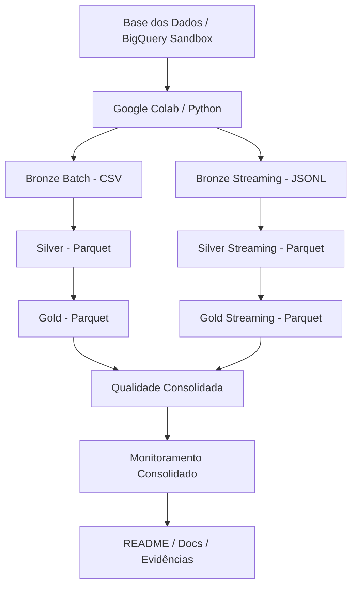
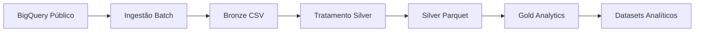
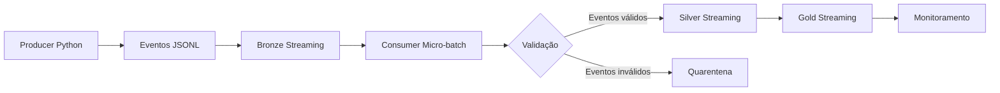

# Arquitetura da Solução

## Visão Geral

A arquitetura utiliza BigQuery Sandbox como fonte cloud, Google Colab como ambiente de execução e arquivos CSV, JSONL e Parquet para materialização das camadas.

## Fluxo Batch

## Fluxo Streaming

## Camadas

- Bronze: dados brutos e eventos originais.
- Silver: dados padronizados e validados.
- Gold: bases analíticas finais.
- Quality: validação consolidada.
- Monitoring: observabilidade e status executivo.
