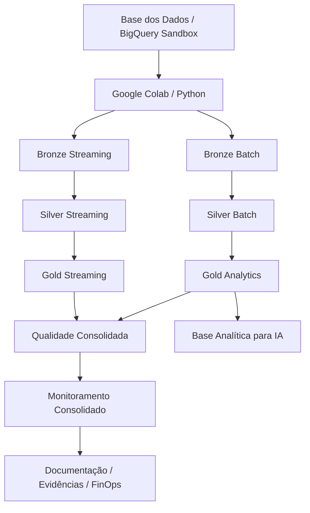
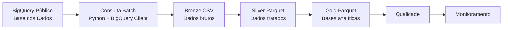
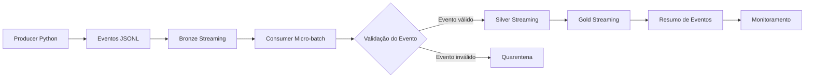
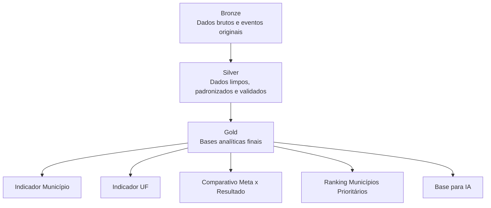
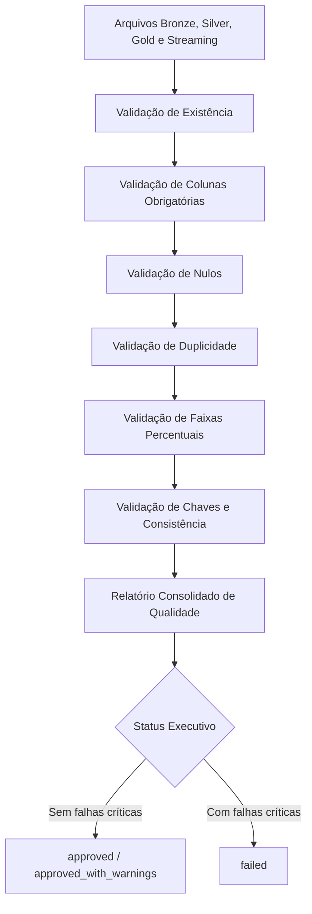
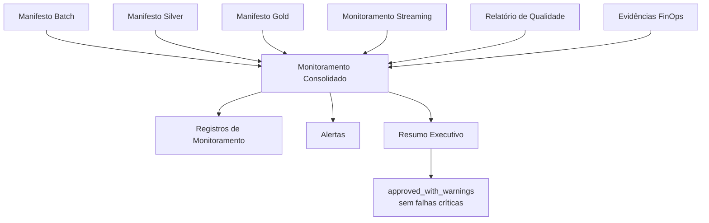
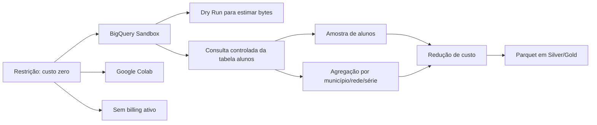
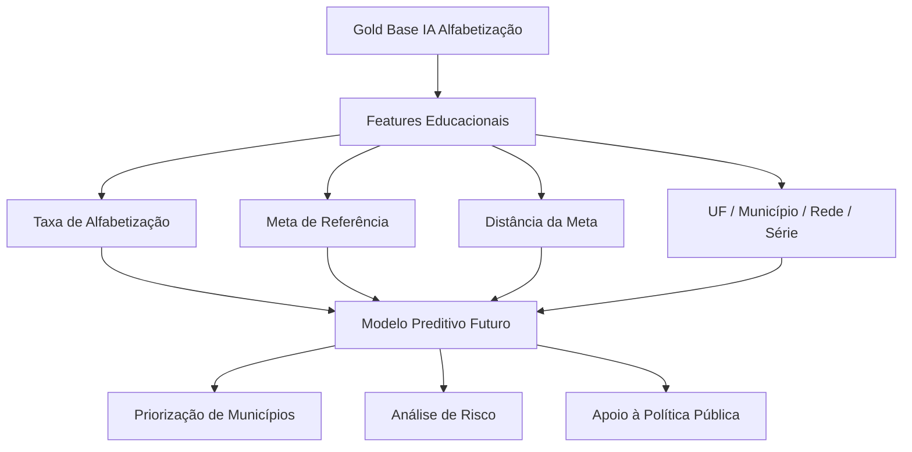
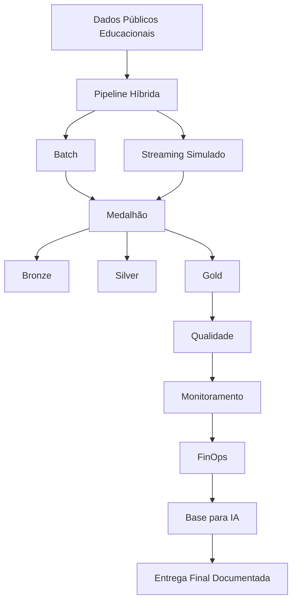

# Diagramas Finais da Arquitetura

## 1. Visão Geral da Solução

## 2. Pipeline Batch

## 3. Pipeline Streaming Simulado

## 4. Arquitetura Medalhão

## 5. Qualidade de Dados

## 6. Monitoramento Consolidado

## 7. FinOps e Custo Zero

## 8. Aplicação em IA

## 9. Resumo Visual da Entrega

## 10. Observação

Os diagramas foram escritos em Mermaid para renderização automática no GitHub.  
Eles complementam o README e o arquivo `docs/architecture.md`.
